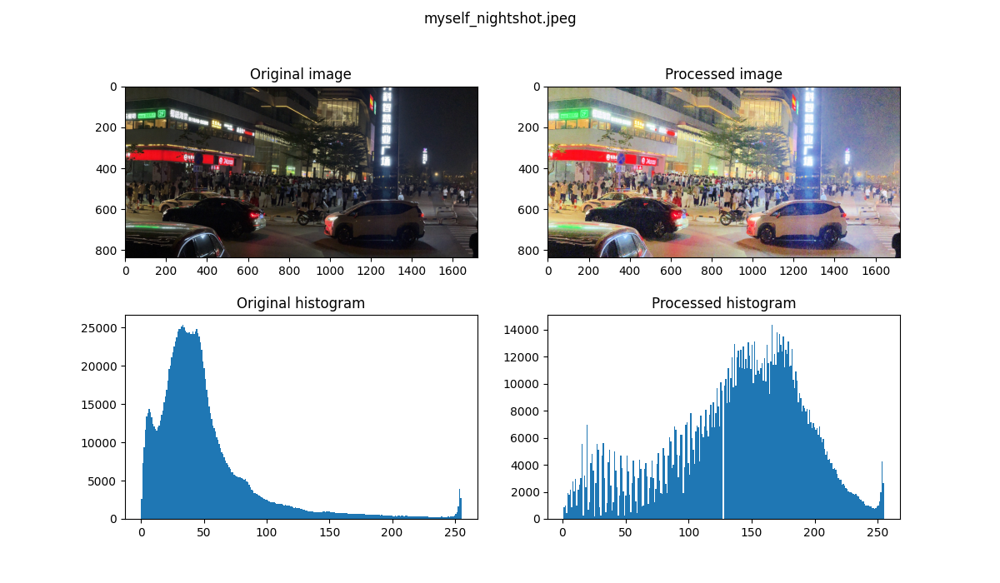

# **HDR_by_DifferentialIntensitySaturation**



主要是復現這篇論文

Nakai, Keita, Yoshikatsu Hoshi, and Akira Taguchi. "Color image contrast enhacement method based on differential intensity/saturation gray-levels histograms."  *2013 International Symposium on Intelligent Signal Processing and Communication Systems* . IEEE, 2013.

進度：在自己拍的暗光夜景有好的效果，但是原論文樣本上[[1]](pictures/result_bridge.jpg.png)[[2]](pictures/result_cherryblossom.jpg.png)復現的效果，並未像論文中那麼好。

---

第一步：先復現一個最簡單常用的 Histogram equalization。HE.py

關鍵：0~255 的 CDF 映射表


---

第二步：再復現使用到空間＆亮度訊息的 Differential intensity histogram equalization。DIHE.py

關鍵：差分量直方圖


---

第三步：再復現使用到空間＆飽和度訊息的 Differential saturation histogram equalization。DSHE.py

關鍵：Local correlation of saturation and intensity


---

第四步：以互補比例混合 DIHE & DSHE => The DHE for color images (DHECI)。DHECI.py

```python
# eq. 7
alpha = 0.5
diff_hist_color = alpha * diff_saturation_hist + (1 - alpha) * diff_intensity_hist
```

---

向量化加速：local_correlation_of_intensity_saturation.py

無向量化：

```python
def local_correlation_of_intensity_saturation(s, v):
```

```bash
local_correlation_of_intensity_saturation: 19.283746004104614 seconds
local_correlation_of_intensity_saturation: 2.2866947650909424 seconds
local_correlation_of_intensity_saturation: 4.0586559772491455 seconds
```

向量化：

```python
def local_correlation_of_intensity_saturation_vectorlize(s, v):
```

```bash
RuntimeWarning: invalid value encountered in divide
  around25_corr = around25_cov_xy / np.sqrt(around25_var_x * around25_var_y)
local_correlation_of_intensity_saturation_vectorlize: 0.6869769096374512 seconds
local_correlation_of_intensity_saturation_vectorlize: 0.06972908973693848 seconds
local_correlation_of_intensity_saturation_vectorlize: 0.1213228702545166 seconds
```
